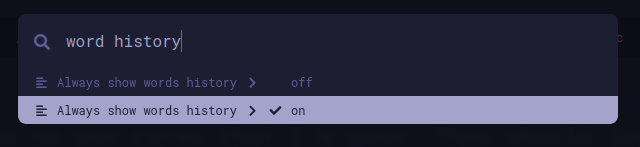

# MonkeySee  

An addon to log mistyped words on [monkeytype.com](https://monkeytype.com).  

## Features
- Logs mistyped words on [monkeytype.com](https://monkeytype.com).
- Displays the mistyped words in a list.
- Allows you to copy the mistyped words to your clipboard.
- Allows you to clear the mistyped words list individually or all at once.

## Setup Instructions  

### 1. Enable "Always show words history" on MonkeyType  
- Press the `Esc` key on [monkeytype.com](https://monkeytype.com).  
    
- Search for **"words history"** and enable it. It should look like this:  
    

### 2. Install the Addon  
- Get the addon from the [Firefox Add-ons Store](https://addons.mozilla.org/en-US/firefox/addon/monkeysee/).  

### 3. Allow Permissions  
- Grant the required permissions and pin the addon to your toolbar for easy access.  

> **⚠️ Disclaimer**  
> The icons used in this project belong to their respective owner ([monkeytype.com](https://monkeytype.com)).  
> The use of these icons does not imply any affiliation (other than being an addon), endorsement, or ownership.  
> If you are the original creator and wish to have them removed, contact me.
